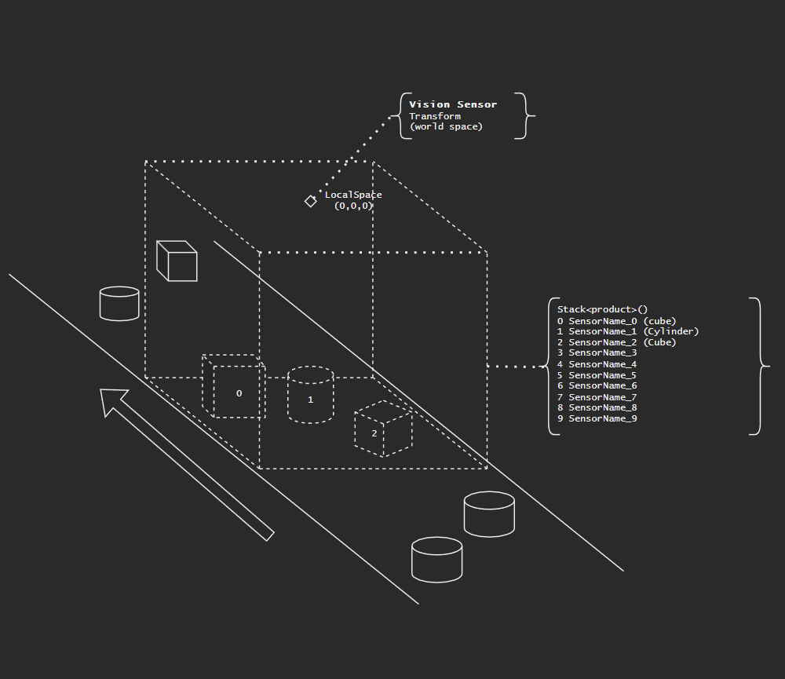

# RSE API

## Introduction
Welcome to the API documentation for the Digital twin. These docs will provide you with all the necessary information to effectively utilize the API and send data to the XR4industry digital twin environment.

This API is designed to enable two way communication between your aplication and the digital twin. To send Motor positions and read out various sensor data.

<br>

## General Overview
Generally the API can be devided in three main parts:
- **Connections** our active endpoints to send to
- **Abstract and simple datatypes** what you want to send
- **Queries** The type of request you want to make

### Connections
To start sending or receiving signals to and from our digital twin first we need to establish a connnection. Typically when on a local machine this is done using: `Request.Connect()`

### Abstract and simple datatypes
There's two types of data in our digital twin. Abstract ones that describe some physical process and also simple types which are for sending primarily configuration data and sensor feedback. **NOTE**: Names must always be unique.
The most common Datatype is an Axis defined as such: 
``` 
new RSE.Types.Axis()
{
	String Name;
	Double Value;
	Unit {Custom, Meter, Decimeter, Centimeter, Millimeter, Micrometer, Radian, Arcdegree};
	IOType {Input, Output};
}
```

### Queries
The API uses a simple CRUD system with four basic queries in which you can either send or retrieve some data Example:
```
Query.Create();
Query.Select<T>();
Query.Update();
Query.Delete()
```

### Knowing what to query
At the top left corner of the Digital twin theres an icon when clicked twice it shows all the queriable signals currently available in the digital twin. When trying to query non-existing signals a warning will be logged in the console. This is marked with a yellow dot. When a red dot is shown the server process has crashed and must be restarted to send any further queries.

<br>

# Connections
All things related to connections.
### `Request.Connect(int port, string adress)`
Connect to a digital twin or change active socket. If no connnections are open then `Request.Connect()` will establish a new one. If you have previously connected then it will switch active sockets.

Optional parameters:

| Property   | Description | Default|
| --------   | ----------- | ------ |
| int port | Specify a specific port to connect to        | `5555`
| string adress | Specify an enpoint adress to connect to, this can be anything on your local network        | `tcp://localhost:`

**Examples:**
```CS
// Example 1 - making a simple local connection
Request.Connect();


// Example 2 - opening two local connections
Request.Connect(6969);
Request.Connect(4200);
// Queries will now connect to endpoint 4200 to send queries to 6969 connnect to it again to switch connection


// Example 3 - local network connection
Request.Connect(5555, "tcp://<local IP>:");

```

---

### `Request.Disconnect()`
Disconnect currently active socket

**Examples:**
```CS
Request.Connect(); // connect to default local connection 
Request.Disconnect(); // disconnect socket
```

---

### `bool Request.ConnectionStatus()`
Check if connection is open and functioning. 
Waits for a reply if none is recieved returns false

**Examples:**
```CS
// Logs to console wether or not connnection is active and functioning
Console.Writeline($"Is my connection active? '{Request.ConnectionStatus()}'");  
```

---

<br>
<br>

# Datatypes
the various datatypes can be divided in two catagories. Abstract and simple types. Abstract types are typically directly related to mechanical function and abstract types typically hold configuration and sensor data.

### `RSE.Types.Axis : IMessage`
The most commonly used abstract datatype in the digital twin used for controlling most rotations an linear movements.

| Type | Property   | Description |
|------|------------|-------------|
|	String	|	Name	| The name of the signal may not include spaces [case sensitive]	
| double | Value| The value of the axis
| IoType | IO | [optional] Indicates wether Axis is an input or an output 
| Axis.Unit | Unit | [optional] Indicates which unit the axis is defined in

**Examples:**
```CS
// Make a nice axis
RSE.Types.Axis MyBeatifullAxis = new RSE.Types.Axis()
{
	Name = "ThingIWantToRotate",
	Value = 20,
};
```

---

### `RSE.Types.Transform : IMessage`
Abstract datatype used for transformations in 3D space can represent position, rotation and scale uses vectors to for 

| Type | Property   | Description |
|------|------------|-------------|
|	String	|	Name	| The name of the signal may not include spaces [case sensitive]	
| RSE.Types.Vector3 | Position| Indicates position in meters
| RSE.Types.Vector3 | Rotation| Indicates Rotation in eulerangles
| RSE.Types.Vector3 | Scale| scale in meters, typically should be set to 1,1,1
| IoType | IO | [optional] Indicates wether Axis is an input or an output 

> **important remark** : the digital twin uses a right-handed Y-up coordinate system 
```
	Y
	|   Z
	| ／
	.-----X

```

**Examples:**
```CS
// a transform for an object rotated around the Y axis
RSE.Types.Transform VeryNiceTransform = new RSE.Types.Transform()
{
	Name = "SlightlyRotatedObject",
	Position = new Vector3(0f, 0, 0),
	Rotation = new Vector3(0, 40, 0),
	Scale = new Vector3(1, 1, 1), // scale typically should be set to 1,1,1
};
```

---

### `RSE.Types.Product : IMessage`
Products are at the core of what makes the XR4industry digital twin so powerfull. It is possible to instantiate products at any infeed/spawner in the scene. These spawners are denoted by a specific number. this number indicates its spawner index. It is important that you use the right spawner index number when spawning a product.

_**Beware, names must be unique!, also remember to set a positive value in the scale**_

| Type | Property   | Description |
|------|------------|-------------|
|	String	|	Name	| The name of the signal may not include spaces [case sensitive]	
| string | color| Color of the product, any HTML color code should work typically HEX is used
| RSE.Types.Transform | Position| The position, rotation and scale


**Examples:**
```CS
// Example 1 - spawn a green product of 1m³
// make the cube
RSE.Types.Product BigRedCube = new RSE.Types.Product()
{
	Name = "BIG_RED_CUBE!", // must be unique, like you
	Color = "#FF0000", // make it red!
	Spawner = 1, // spawn at spawner index 1
	Transform = new Transform()
	{
		Position = new Vector3(0,0,0),
		Rotation = new Vector3(0,0,0),
		Scale = new Vector3(1,1,1),
	}
}
RSE.Query.Create(BigRedCube); // spawn our beautifull big red cube into the scene


// Example 2 - spawn 10 bricks spaced evenly apart from one another varying in color
for (int i = 0; i < 9; i++)
{		
	RSE.Types.product brick = new RSE.Types.Transform()
	{
		Name = $"brick_{i}}", // adds a number to the product to ensure product names are unique
		Transform = new Transform()
		{
			Position = new Vector3(0,0,0),
			Rotation = new Vector3(0,0,0),
			Scale = new Vector3(1,1,1),// scale typically should be set to 1,1,1
		}
	};
}

```

---

### `RSE.Types.Single : IMessage`
A simple datatype for sending and receiving floats

| Type | Property   | Description |
|------|------------|-------------|
|	String	|	Name	| The name of the signal may not include spaces [case sensitive]	
| float | Value| The value of the signal

**Examples:**
```CS
// how you might want to create a single when wanting to read some sensor
RSE.Types.Single SomeSensorIWantToRead = new RSE.Types.Single()
{
	Name = "Sensor_420",
	Value = 0,
};
```

---

### `RSE.Types.Boolean : IMessage`
A simple datatype for sending and receiving booleans

| Type | Property   | Description |
|------|------------|-------------|
|	String	|	Name	| The name of the signal may not include spaces [case sensitive]	
| bool | Value| The value of the signal

**Examples:**
```CS

```

---

<br>
<br>

# Queries
The API uses a simple CRUD system involving four basic queries: `Create(), Select<T>(), Update(), Delete()` These queries form the basis of all interactions with the digital twin.

### `Query.Create()`
This query is used for creating new signals. Most commonly the create query is used for instantiating new products into a scene. Typically you do not have to create any signals besides products.

Optional parameters:

| Property   | Description | Default|
| --------   | ----------- | ------ |
| iMessage | Any API datatype you would like to create, please not all signal names must be Unique         | 

**Examples:**
```CS
// Creates a new axis named "appelflap" into the scene
RSE.Query.Create(new RSE.Types.Axis(){Name = "appelflap"};);
```

---

### `Query.Select<T>(IMessage) : where T is iMessage`
The Select query is used for retrieving data from the digital twin. Typically used for reading out sensor data. When selecting data it is the name in the signal that matters. the rest of the signal may remain empty.

Optional parameters:

| Property   | Description | Default|
| --------   | ----------- | ------ |
| iMessage | Any API datatype you would like to create, please not all signal names must be Unique         | 

**Examples:**
```CS
// Log to console wether or not distance sensor has a detection within 10 centimeters 
float distance = RSE.Query.Select<RSE.Types.Single>(new Single(){Name = "mySensor"}).Value;

if(distance < 0.01f)
    Console.WriteLine("detection within 10cm);

```

---

### `Query.Update(IMessage message)`
The most commonly used query. This is the primary way to update positions, drive motors, and send new commands to the digital twin.

Optional parameters:

| Property   | Description | Default|
| --------   | ----------- | ------ |
| iMessage | Any API datatype you would like to Update, please note all signal names must be Unique         | 

**Examples:**
```CS
// Example 1 - move a robot by 20 degrees
RSE.Query.Update(new Axis(){Name = "RobotBottomAxis", Value = 20});


// Example 2 - interpolate movement
// you can make a motion linearly interpolate to create a smooth motion

// a simple interpolate function
public static float Lerp(float start, float end, float pct)
{
	return (start + (end - start) * pct);
}

// a naive implementation of a simple interpolation function for axes
public static void LinearUpdateAxis(Axis target, float start, float end, float duration)
{
	float time = 0;

	while (time <= duration)
	{
		target.Value = Lerp(start, end, time / duration);
		RSE.Query.Update(target);
		Thread.Sleep(1);
		time++;
	}
}


```

---

### `Query.Delete(IMessage message)`
The least commonly used query. The delete query is used primarily for deleting products. Typically you don't want to delete any other signals if you do you might be at risk of breaking the simulation and having to restart.

Optional parameters:

| Property   | Description | Default|
| --------   | ----------- | ------ |
| iMessage | Any API datatype you would like to Delete, please note all signal names must be Unique         | 

**Examples:**
```CS
// Example 1 - create and then delete a product after 5 seconds
RSE.Types.Product BigRedCube = new RSE.Types.Product()
{
	Name = "BIG_RED_CUBE!", // must be unique, like you
	Color = "#FF0000", // make it red!
	Spawner = 1, // spawn at spawner index 1
	Transform = new Transform()
	{
		Position = new Vector3(0,0,0),
		Rotation = new Vector3(0,0,0),
		Scale = new Vector3(1,1,1),
	}
}
RSE.Query.Create(BigRedCube); // spawn our beautifull big red cube into the scene

Thread.Sleep(5000); // wait 5 seconds

RSE.Query.Delete(BigRedCube); // delete our product 


// Example 2 - delete all products
var products = RSE.Query.SelectAllProducts() // get all products
foreach(var product in products) // loop through products
	Query.Delete(product); // delete product

```

---

<br>
<br>

# Additional examples

## Using the vision sensor.
The vision sensor does not have it's own unique datatype and instead uses existing datatypes to convey its state. It is important to properly understand this sensor when utulizing this powerfull component.

### Setting up a vision sensor
When creating a vision sensor it is important to set the correct detection volume. Setting up the volume can result in confusing and hard to read data or lack of detections. 

1. Due to a current technical limitation the sensor cannot be rotated.
2. Only products which area fall full within the bounds of the sensor are detected. as shown in the diagram below. _PARTIALLY VISIBLE PRODUCTS ARE NOT DETECTED_
3. Product positions are relative to the position of the sensor.\
4. The name of the transform within the list of products created is the name of the detected product

### Reading a vision sensor:
Reading the vision sensor is a bit different than other types of sensors as it has a big bundle of standardized product data to read out. The names of the products stay the same but the transform name is the name of the detected product.

**Example:**
```CS
// an example of how one might detect changes of the fist vision sensor in the scene.
List<Product> VisionProducts = new();

internal void SetupVisionSensor()
{
	VisionProducts.Add(new Product("VisionSensor_1_0"));
	VisionProducts.Add(new Product("VisionSensor_1_1"));
	VisionProducts.Add(new Product("VisionSensor_1_2"));
	VisionProducts.Add(new Product("VisionSensor_1_3"));
	VisionProducts.Add(new Product("VisionSensor_1_4"));
	VisionProducts.Add(new Product("VisionSensor_1_5"));
	VisionProducts.Add(new Product("VisionSensor_1_6"));
	VisionProducts.Add(new Product("VisionSensor_1_7"));
	VisionProducts.Add(new Product("VisionSensor_1_8"));
	VisionProducts.Add(new Product("VisionSensor_1_9"));

}

// if the name of the visionproduct transform component changes then we have an update.
// this function returns all the indexes of the visionsensor products that have a detection.
internal List<Product> CheckForVisionUpdates()
{
	List<Product> DetectedProducts = new()

	foreach(product item in VisionProducts)
	{
		item = Query.Select<Product>(item);

		if(item.Transform.Name != "")
		{
			DetectedProducts.Add(item);
		}
	}

	return DetectedProducts;
}

```
Vision sensor diagram:

